# Phase 1: Environment Setup, Hardening & Central Telemetry Configuration

This phase establishes the foundational environment for the cloud SOC lab. It covers Azure resource deployment, network segmentation, secure administrative access, Microsoft Sentinel onboarding, host auditing, Sysmon deployment, and the initial telemetry foundation required for subsequent detection engineering.

The design follows a zero-trust-oriented approach: the Windows target host has no public IP address, administrative access is provided through Azure Bastion, and inbound RDP is restricted to the Bastion subnet. Central telemetry is collected into a dedicated Log Analytics workspace and consumed by Microsoft Sentinel.

## Architectural Blueprint & Data Pipeline Design

The environment is designed around secure remote administration, network segmentation, least-privilege access, and centralized security telemetry.

### 1. Zero-Trust-Oriented Network Topology

Direct RDP exposure to the public internet is eliminated. The Windows target host resides on a private subnet and does not have a public IP address. Administrative sessions are established through Azure Bastion rather than exposing TCP/3389 directly to the internet.

The target VM's Network Security Group (NSG) permits RDP only from the dedicated Azure Bastion Subnet address range.


### 2. Split-Stream Telemetry Architecture

The lab uses two complementary Windows telemetry sources:

Windows Security Auditing: Native Windows process-creation auditing generates Event ID 4688. These events are collected through the Microsoft Security Events data source and are represented in the Security Event table.

Sysmon Telemetry: Sysmon provides enhanced endpoint telemetry such as process creation, file creation, registry activity, and network-related events according to its active configuration. These Windows Event Log records are collected through the generic Windows Event Log pipeline and are represented in the Event table.

This separation preserves the native Security Event schema for Windows security auditing while allowing Sysmon telemetry to be collected independently for later detection engineering and threat hunting.

The Sysmon event channel used by the lab is:

```Microsoft-Windows-Sysmon/Operational```


## Step-by-Step Cloud Infrastructure Deployment

### 1. Context Initialization

Administrative identifiers are captured within the Azure CLI session to maintain consistent subscription and resource-group scope throughout deployment.

```bash
MYID=$(az ad signed-in-user show --query id -o tsv)
SUBID=$(az account show --query id -o tsv)
```

Verify the active subscription and signed-in identity before continuing:

```az account show --query "{subscriptionId:id, tenantId:tenantId, user:user.name}" -o table```

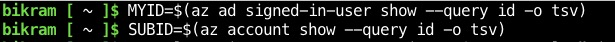

### 2. Resource Group & CLI Context Setup

Creates the primary deployment resource group (rg-soc-capstone) in the centralus region and sets it as the default Azure CLI resource group and location.

```bash
az group create -n rg-soc-capstone -l centralus
az configure --defaults group=rg-soc-capstone location=centralus
```

The resource group provides the management boundary for the lab's Azure resources.

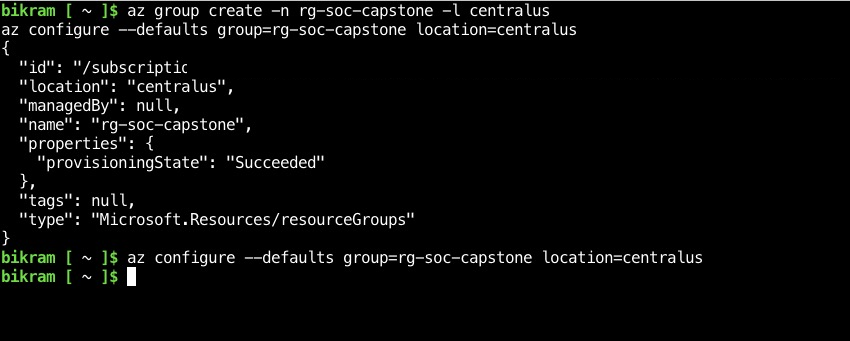

### 3. Least-Privilege Identity Management (RBAC)

The deployment identity is granted the permissions required to administer Microsoft Sentinel and the Log Analytics workspace at the resource-group scope.

```bash
az role assignment create --assignee $MYID --role "Microsoft Sentinel Contributor" --scope /subscriptions/$SUBID/resourceGroups/rg-soc-capstone

az role assignment create --assignee $MYID --role "Log Analytics Contributor" --scope /subscriptions/$SUBID/resourceGroups/rg-soc-capstone
```

These assignments provide the management-plane permissions required for the lab without granting broader subscription-wide administrative privileges.

**Security note: RBAC assignments should be scoped as narrowly as practical. If a narrower resource-level scope is sufficient for a particular operation, that scope should be preferred.**

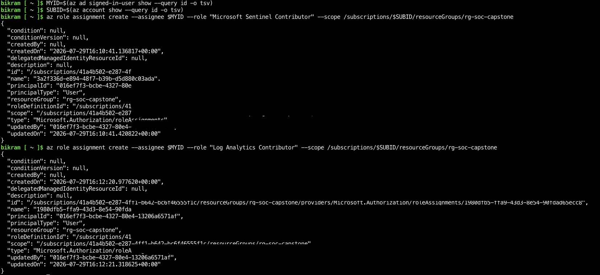

### 4. Dedicated Azure Bastion Subnet

A dedicated subnet named Azure Bastion Subnet is created inside the target VNet.

```bash
az network vnet subnet create \
  --vnet-name vm-soc-targetVNET \
  -n AzureBastionSubnet \
  --address-prefixes 10.0.1.0/26
```
The subnet is reserved exclusively for Azure Bastion infrastructure.

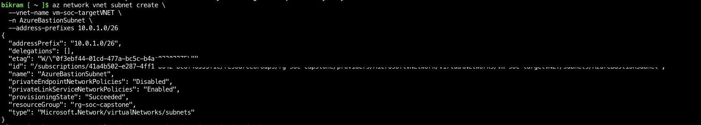

### 5. Private Windows Target Host Provisioning

The Windows 11 target workstation is deployed without a public IP address. The VM is placed on the private target subnet and is accessed administratively through Azure Bastion.

```bash
az vm create \
  -n vm-soc-target \
  --size Standard_D2s_v7 \
  --public-ip-address "" \
  --admin-username labadmin \
  --admin-password "<LAB_ADMIN_PASSWORD>" \
  --image MicrosoftWindowsDesktop:windows-11:win11-24h2-pro:latest
```

The administrator password is intentionally represented as a placeholder in this documentation. Credentials should not be committed to source control or published in the project README.

The VM receives a private address from the target subnet and has no direct public network interface.

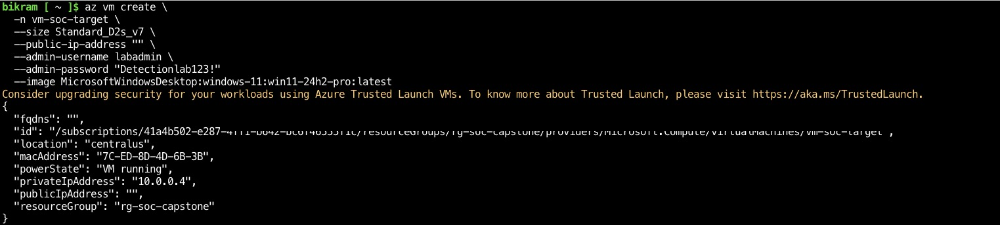

### 6. Network Security Group Inbound Hardening

An explicit NSG rule permits RDP only from the Azure Bastion subnet.

```bash
az network nsg rule create \
  --nsg-name vm-soc-targetNSG \
  -n Allow-RDP-From-Bastion \
  --priority 100 \
  --source-address-prefixes 10.0.1.0/26 \
  --destination-port-ranges 3389 \
  --access Allow \
  --protocol Tcp
```

The security objective is to allow administrative RDP traffic from the Bastion subnet while preventing direct public RDP exposure.

The VM's lack of a public IP is an additional control that prevents direct internet-based RDP connectivity.

The resulting rule is:
```
Name: Allow-RDP-From-Bastion

Priority: 100

Source: 10.0.1.0/26

Destination port: 3389

Protocol: TCP

Access: Allow
```

Verify the rule if required:

```bash
az network nsg rule show \
  --nsg-name vm-soc-targetNSG \
  --resource-group rg-soc-capstone \
  --name Allow-RDP-From-Bastion \
  -o table
```

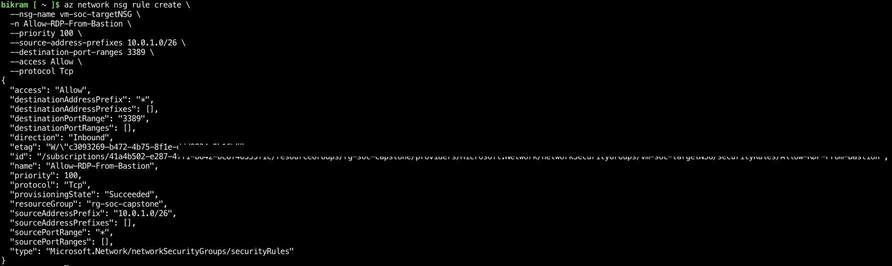

### 7. Bastion Public IP Provisioning

A Standard SKU public IP address is created for the Azure Bastion service. The public IP belongs to the Bastion management gateway rather than the target VM.

The following command was used after the Azure CLI defaults were configured:

```bash
az network public-ip create -n bastion-pip --sku Standard
```

The command completed successfully. The resulting resource shown in the deployment output has:

```
Name: bastion-pip

Location: centralus

Provisioning state: Succeeded

IP version: IPv4

Allocation method: Static

SKU: Standard
```

The Azure CLI displayed a warning concerning a future change to the default zone behavior for Standard SKU public IP addresses. This warning did not indicate a deployment failure.

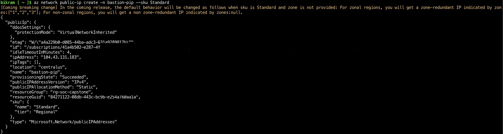

### 8. Azure Bastion Ingress Gateway Construction

The managed Azure Bastion gateway is deployed into the target VNet and attached to the previously created public IP.

Because the resource group and location were already configured as Azure CLI defaults, the command used was:

```bash
az network bastion create \
  -n bas-soc-capstone \
  --vnet-name vm-soc-targetVNET \
  --public-ip-address bastion-pip
```

Administrative access to the Windows target is subsequently performed through the Bastion service rather than by exposing RDP directly to the internet.

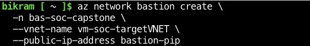

### 9. Log Analytics Workspace Creation & Daily Ingestion Safeguard

The dedicated Log Analytics workspace must exist before a daily ingestion quota can be configured.

Create the workspace:

```bash
az monitor log-analytics workspace create \
  --name law-soc-lab-v2 \
  --resource-group rg-soc-capstone \
  --location centralus
```

Configure the lab's daily ingestion safeguard:

```bash
az monitor log-analytics workspace update \
  --name law-soc-lab-v2 \
  --resource-group rg-soc-capstone \
  --quota 0.3
```

The lab uses a 0.3 GB/day cap as a cost-protection safeguard during development and detection-engineering testing.

***Operational warning: The daily cap is a cost-protection mechanism, not a normal ingestion-control mechanism. If the cap is reached, collection of affected billable data can stop for the remainder of the period. This can result in loss of monitoring and Sentinel detection coverage until collection resumes.***

Verify the workspace configuration if required:

```bash
az monitor log-analytics workspace show \
  --name law-soc-lab-v2 \
  --resource-group rg-soc-capstone \
  --query "{name:name, location:location, dailyQuotaGb:workspaceCapping.dailyQuotaGb}" \
  -o table
```

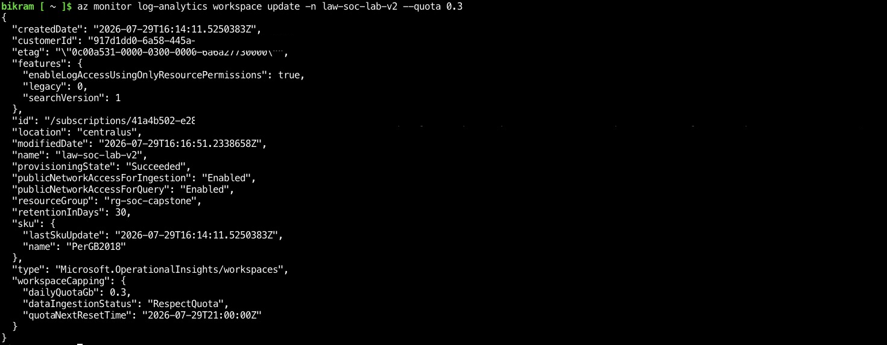

### 10. Microsoft Sentinel Onboarding

Microsoft Sentinel is onboarded to the dedicated Log Analytics workspace.

```bash
az extension add --name sentinel

az sentinel onboarding-state create \
  --resource-group rg-soc-capstone \
  --workspace-name law-soc-lab-v2 \
  --name default \
  --customer-managed-key false
```

This establishes the Sentinel security monitoring layer over the Log Analytics workspace.

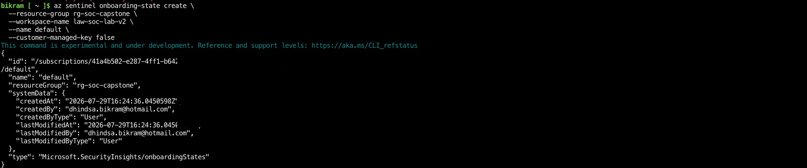

----

## Target Host Auditing & Log Engine Configuration

With the Azure networking and management plane established, the Windows target host is configured to generate the endpoint telemetry required by the SOC lab.

### 1. Native Windows Security Process Auditing

**Force subcategory-level audit policy first.** By default, Windows can silently fall back to legacy, category-level audit settings and ignore subcategory-level `auditpol` configuration entirely — even though the command itself reports success. This must be enabled before setting the subcategory policy below, or Process Creation auditing may appear configured while producing no events:

```powershell
New-ItemProperty `
  -Path "HKLM:\SYSTEM\CurrentControlSet\Control\Lsa" `
  -Name "SCENoApplyLegacyAuditPolicy" `
  -Value 1 `
  -PropertyType DWord `
  -Force
```

With legacy fallback disabled, Windows process creation auditing is enabled to generate Security EventID 4688.

```auditpol /set /subcategory:"Process Creation" /success:enable```

Command-line capture is enabled so that process creation events contain the command-line context required for later detection engineering.

```powershell
New-ItemProperty `
  -Path "HKLM:\SOFTWARE\Microsoft\Windows\CurrentVersion\Policies\System\Audit" `
  -Name "ProcessCreationIncludeCmdLine_Enabled" `
  -Value 1 `
  -PropertyType DWord `
  -Force
```

Verify the auditing configuration:

```powershell
auditpol /get /subcategory:"Process Creation"

Get-ItemProperty `
  -Path "HKLM:\SOFTWARE\Microsoft\Windows\CurrentVersion\Policies\System\Audit" `
  -Name "ProcessCreationIncludeCmdLine_Enabled"
```

These settings are not retroactive. They affect process-creation events generated after the configuration is enabled.

### 2. Sysmon Installation & Configuration

System Monitor (Sysmon) v15.21 is deployed as the enhanced endpoint telemetry engine for this lab. Sysmon provides additional endpoint telemetry according to the active configuration, including process creation and other system activity relevant to later detection engineering.

The lab uses the Sysmon distribution package and the sysmonconfig-export.xml configuration from the "SwiftOnSecurity/sysmon-config" project.

**Download Sysmon**

```powershell
$LabRoot = "$env:TEMP\SOC-Lab"
New-Item -ItemType Directory -Path $LabRoot -Force | Out-Null

Invoke-WebRequest `
  -Uri "https://download.sysinternals.com/files/Sysmon.zip" `
  -OutFile "$LabRoot\Sysmon.zip"

Expand-Archive `
  -Path "$LabRoot\Sysmon.zip" `
  -DestinationPath "$LabRoot\Sysmon" `
  -Force
```

**Download the configuration**
```powershell
Invoke-WebRequest `
  -Uri "https://raw.githubusercontent.com/SwiftOnSecurity/sysmon-config/master/sysmonconfig-export.xml" `
  -OutFile "$LabRoot\sysmonconfig-export.xml"
```

The configuration determines which Sysmon event types and filtering rules are active. It should therefore be treated as part of the lab's telemetry baseline.

**Install Sysmon**

Run from an elevated PowerShell session:

```powershell
& "$LabRoot\Sysmon\Sysmon64.exe" `
  -accepteula `
  -i "$LabRoot\sysmonconfig-export.xml"
```

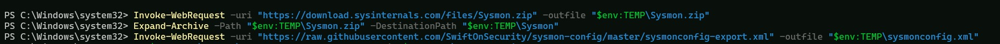

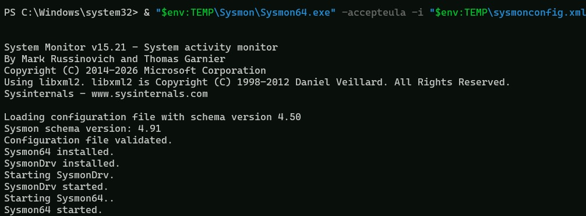

### 3. Sysmon Service & Configuration Validation

Confirm that the Sysmon service is running:

```powershell
Get-Service -Name "Sysmon64"
```


Confirm the installed Sysmon version:

```& "$LabRoot\Sysmon\Sysmon64.exe" -?```

Review the active configuration:

```& "$LabRoot\Sysmon\Sysmon64.exe" -c```

### 4. Sysmon Event Channel Validation

Sysmon events are written to:

```
Applications and Services Logs
└── Microsoft
    └── Windows
        └── Sysmon
            └── Operational
```

The channel can be validated from PowerShell:

```powershell
Get-WinEvent -ListLog "Microsoft-Windows-Sysmon/Operational"
```

A harmless process can be used to generate a Sysmon process-creation event:

```powershell
Start-Process notepad.exe
```

Then verify Event ID 1 locally:

```powershell
Get-WinEvent -FilterHashtable @{
    LogName = "Microsoft-Windows-Sysmon/Operational"
    Id      = 1
} -MaxEvents 5
```

### 5. Windows Security Event 4688 Validation

A harmless process can also be used to confirm native Windows process-creation auditing:

```
Start-Process notepad.exe
```

Then query the Security log:

```powershell
Get-WinEvent -FilterHashtable @{
    LogName = "Security"
    Id      = 4688
} -MaxEvents 5
```

This confirms that the native Windows process-creation audit policy is producing the expected source telemetry before central collection is evaluated.

---

## Central Telemetry Collection: Data Collection Rule (DCR)

With the Log Analytics workspace, Sentinel onboarding, native Windows auditing, and Sysmon all in place, a single Data Collection Rule (DCR) is used to route both telemetry sources from the target VM into the workspace.

### Split-stream design

Windows Security events and Sysmon events use different underlying schemas, so they are configured as two separate data sources within the same DCR, each mapped to its own stream and destination table:

| Source | XPath query | Stream | Destination table |
| :--- | :--- | :--- | :--- |
| Windows Security auditing | `Security!*` | `Microsoft-SecurityEvent` | `SecurityEvent` |
| Sysmon | `Microsoft-Windows-Sysmon/Operational!*` | `Microsoft-Event` | `Event` |
---

Bundling both XPath queries under a single stream is not supported, since the `Microsoft-SecurityEvent` stream expects the Security log's schema specifically and cannot parse Sysmon's event structure. Each source requires its own `dataSources` entry and a corresponding `dataFlows` entry mapping that stream to the workspace destination — omitting the second `dataFlows` entry results in the data source being configured but never actually delivered.

### DCR definition

```json
{
  "location": "centralus",
  "kind": "Windows",
  "properties": {
    "dataSources": {
      "windowsEventLogs": [
        {
          "name": "securityEventDataSource",
          "streams": ["Microsoft-SecurityEvent"],
          "xPathQueries": ["Security!*"]
        },
        {
          "name": "sysmonEventDataSource",
          "streams": ["Microsoft-Event"],
          "xPathQueries": ["Microsoft-Windows-Sysmon/Operational!*"]
        }
      ]
    },
    "destinations": {
      "logAnalytics": [
        {
          "name": "DataCollectionEvent",
          "workspaceResourceId": "/subscriptions/<SUBSCRIPTION_ID>/resourceGroups/rg-soc-capstone/providers/Microsoft.OperationalInsights/workspaces/law-soc-lab-v2"
        }
      ]
    },
    "dataFlows": [
      { "destinations": ["DataCollectionEvent"], "streams": ["Microsoft-SecurityEvent"] },
      { "destinations": ["DataCollectionEvent"], "streams": ["Microsoft-Event"] }
    ]
  }
}
```

The subscription ID is intentionally represented as a placeholder in this documentation, consistent with the credential-handling approach used elsewhere in this README.

### Creating the DCR

```bash
az monitor data-collection rule create \
  -g rg-soc-capstone \
  -n dcr-soc-lab \
  --rule-file dcr.json
```

### Associating the DCR with the target VM

A DCR has no effect until it is explicitly associated with a resource. The Azure Monitor Agent (AMA) must also be installed on the target VM for the association to take effect.

```bash
az vm extension set \
  --resource-group rg-soc-capstone \
  --vm-name vm-soc-target \
  --name AzureMonitorWindowsAgent \
  --publisher Microsoft.Azure.Monitor \
  --enable-auto-upgrade true

az monitor data-collection rule association create \
  --name dcr-soc-lab-association \
  --rule-id "/subscriptions/<SUBSCRIPTION_ID>/resourceGroups/rg-soc-capstone/providers/Microsoft.Insights/dataCollectionRules/dcr-soc-lab" \
  --resource "/subscriptions/<SUBSCRIPTION_ID>/resourceGroups/rg-soc-capstone/providers/Microsoft.Compute/virtualMachines/vm-soc-target"
```

### Verifying the DCR configuration

```bash
az monitor data-collection rule show \
  -g rg-soc-capstone \
  -n dcr-soc-lab \
  --query "dataSources.windowsEventLogs"
```

A correctly configured DCR returns both the `securityEventDataSource` and `sysmonEventDataSource` entries shown above. If only one appears, or if telemetry from one source is missing downstream despite the DCR appearing correctly configured, verify that both corresponding entries also exist under `dataFlows` — a data source without a matching data flow will not error, it will simply never deliver data.


---
## Phase 1 Telemetry Readiness

At the completion of Phase 1, the environment should provide the following baseline:


|       Component	  |       |        Expected State |
| :--- | --- | :---|
| Azure Resource Group| | rg-soc-capstone deployed in centralus|
|Target VM	||vm-soc-target|
|Target VM Public IP	||None|
|Target VM Access	||Azure Bastion|
|Bastion	||bas-soc-capstone|
|Bastion Subnet	||AzureBastionSubnet / 10.0.1.0/26|
|Target RDP Access	||Restricted to Bastion subnet|
|Log Analytics Workspace	||law-soc-lab-v2|
|Daily Ingestion Cap	||0.3 GB/day|
|Microsoft Sentinel	||Onboarded|
|Legacy Audit Policy Fallback	||Disabled (SCENoApplyLegacyAuditPolicy)|
|Windows Process Auditing	||Enabled|
|Windows Process Event	||Security Event ID 4688|
|Sysmon	||v15.21|
|Sysmon Event Channel	||Microsoft-Windows-Sysmon/Operational|
|Sysmon Process Event	||Event ID 1|
|Central Telemetry Design	||SecurityEvent + Event streams|
|Data Collection Rule	||dcr-soc-lab (split-stream: Security + Sysmon)|
|DCR-to-VM Association	||dcr-soc-lab-association|

---

***The final Phase 1 objective is to establish a functioning and hardened environment capable of generating the endpoint telemetry required for the next stage of the SOC lab.***

**Detailed DCR implementation, centralized ingestion verification, analytic rules, threat emulation, and investigation workflows are intentionally handled in subsequent phases.**
 
 ---

## Security & Documentation Notes

- No real credentials should be stored in this README or committed to source control.

- Subscription IDs, object IDs, and other environment-specific identifiers should be redacted from public screenshots where they are not required as evidence.

- The target VM should remain without a public IP address throughout the lab.

- The 0.3 GB/day Log Analytics daily cap is a cost safeguard and should not be treated as a substitute for ingestion management.

- Sysmon configuration filtering is part of the telemetry baseline. Changes to the XML can materially change which events are available for subsequent detections.

- Native Windows auditing and Sysmon are complementary telemetry sources. Sysmon does not replace Windows Security auditing.

- Native Windows audit policy can silently fall back to legacy, category-level settings unless subcategory enforcement (`SCENoApplyLegacyAuditPolicy`) is explicitly enabled. This should be verified early, since it can otherwise cause expected Security events to be missing without any error being raised.
---

## Phase 1 Completion Criteria


**Phase 1 is considered complete when:**

1. The Azure resource group and network infrastructure are deployed.

2. The Windows target VM has no public IP address.

3. Azure Bastion provides the administrative access path.

4. RDP is restricted to the Bastion subnet.

5. The Log Analytics workspace is created and the daily ingestion safeguard is configured.

6. Microsoft Sentinel is onboarded to the workspace.

7. Subcategory-level audit policy enforcement is confirmed active.

8. Windows process-creation auditing produces Event ID 4688.

9. Sysmon is installed and running.

10. Sysmon Event ID 1 is generated successfully.

11. The Data Collection Rule is created with both Security and Sysmon data sources correctly mapped to their respective data flows.

12. The DCR is associated with the target VM and the Azure Monitor Agent is installed.

13. The environment is ready for centralized telemetry collection and subsequent detection engineering.
---


***Phase 1 establishes the infrastructure and endpoint telemetry foundation. Detection logic, analytic rules, threat emulation, and investigation workflows are intentionally handled in later phases.***
