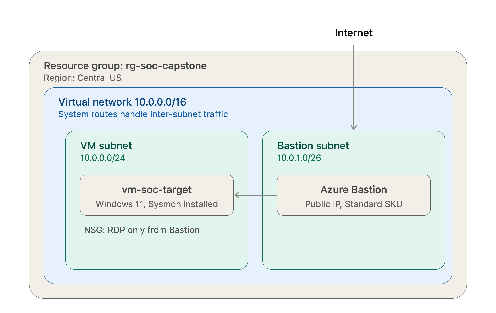
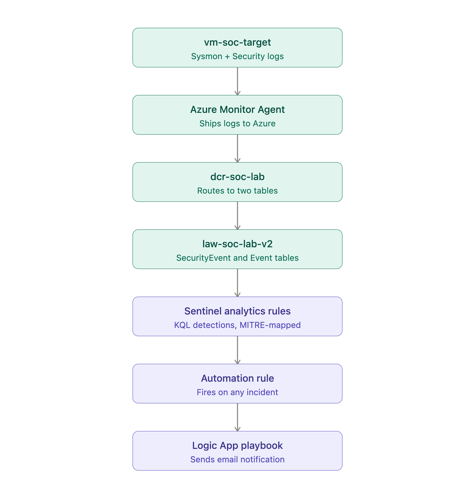

# Full-Chain SOC Detection Lab: Sysmon to Sentinel Detection Pipeline

### An end-to-end security operations lab — from infrastructure deployment through attack simulation, detection engineering, and incident investigation — built entirely on Microsoft Sentinel.

---

## Executive Summary

This project simulates a complete SOC analyst workflow: standing up a monitored environment in Azure, executing a realistic multi-stage attack chain against it, building and validating custom detection logic in Microsoft Sentinel, and investigating the resulting incidents. It was built to extend hands-on cloud security experience beyond CompTIA Security+, CCNA, and a computer science background, with a specific focus on the day-to-day mechanics of SIEM operation: log pipeline configuration, KQL detection engineering, and incident triage.

The environment was deployed with no public-facing RDP exposure at any point — administrative access was routed exclusively through Azure Bastion from the start, a deliberate network hardening decision independent of the attack scenarios the lab detects. Detection coverage was built across two independent telemetry sources (native Windows Security auditing and Sysmon) wherever the technique allowed, so that no single detection depends on one log source alone.

**Result:** 4 custom analytics rules, mapped to 6 MITRE ATT&CK techniques across the Execution, Persistence, and Discovery tactics, generating and correctly triaging 21 incidents from a controlled 4-stage attack simulation.

---

## Architecture





**Network design:** the target VM has no public IP. Azure Bastion, deployed in its own dedicated subnet, is the sole internet-facing resource in the environment. The VM's NSG permits inbound RDP exclusively from the Bastion subnet.

**Telemetry design:** Windows Security auditing and Sysmon are collected through a single split-stream Data Collection Rule, routing to separate Log Analytics tables (`SecurityEvent` and `Event` respectively), feeding Sentinel analytics rules that map directly to the attack chain below.

---

## Attack Chain Simulated

| Stage | Technique | MITRE ATT&CK | Tactic |
| :--- | :--- | :--- | :--- |
| 1 | PowerShell download cradle | T1059.001 | Execution |
| 2 | Registry Run key persistence | T1547.001 | Persistence |
| 3 | Scheduled task persistence | T1053.005 | Persistence |
| 4 | Discovery command sequence | T1033, T1087, T1082, T1057, T1049 | Discovery |

## Key Results

| Metric | Result |
| :--- | :--- |
| Analytics rules built | 4 |
| MITRE ATT&CK techniques covered | 6 |
| Incidents generated and triaged | 21 |
| Telemetry sources | 2 (Windows Security auditing, Sysmon) |
| Log Analytics daily ingestion cap | 0.3 GB (cost guardrail) |
| Public-facing RDP exposure | None (Bastion-only access) |

---

## Methodology

| Phase | Covers | Documentation |
| :--- | :--- | :--- |
| 1 | Environment setup, network hardening, RBAC, telemetry pipeline (DCR) | [`01-environment-setup/Phase-1-README.md`](./01-environment-setup/Phase-1-README.md) |
| 2 | Four-stage attack simulation | [`02-attack-simulation/Phase-2-README.md`](./02-attack-simulation/Phase-2-README.md) |
| 3 | Detection rule development and validation | [`03-detection-engineering/Phase-3-README.md`](./03-detection-engineering/Phase-3-README.md) |
| 4 | Incident investigation and disposition | [`04-incident-report/Phase-4-README.md`](./04-incident-report/Phase-4-README.md) |
| 5 | Consolidated detection dashboard | [`05-dashboard/Phase-5-README.md`](./05-dashboard/Phase-5-README.md) |
| — | Automated response & Copilot: scope notes | [`06-automation-design/Phase-6-README.md`](./06-automation-design/Phase-6-README.md) |

Each phase was built and verified in sequence: raw telemetry was confirmed manually before any detection rule was written against it, and every rule was validated twice — once against existing log data, and again by re-running the live attack stage after the rule was active, to confirm real, automatic incident generation rather than relying on manual query results alone.

---

## Tools & Technologies

**Platform:** Microsoft Azure, Microsoft Sentinel, Log Analytics
**Telemetry:** Sysmon (SwiftOnSecurity configuration), native Windows Security auditing
**Detection:** KQL (Kusto Query Language)
**Access & networking:** Azure Bastion, Network Security Groups, Azure Virtual Network
**Infrastructure:** Azure CLI, Azure Resource Manager (REST API for edge cases the CLI extension couldn't handle)
**Frameworks:** MITRE ATT&CK

---

## Repository Structure

```
├── README.md                      ← you are here
├── LICENSE
│
├── 01-environment-setup/
├── 02-attack-simulation/
├── 03-detection-engineering/
├── 04-incident-report/
├── 05-dashboard/
├── 06-automation-design/          ← automation & Copilot: designed/evaluated, not deployed
│
│__SOC_Capstone_Addendum_v2.md ← build issues encountered and how they were resolved
│
└── Dud_malicious_script.ps1   ← Used in Stage1 Download Cradle
```

---

## Notable Engineering Challenges

A few real issues encountered and resolved during the build, documented in full in the [addendum](./SOC_Capstone_Addendum_v2.md):

- **Split-stream Data Collection Rule:** Sysmon and Windows Security events require separate `dataSources` and matching `dataFlows` entries — bundling both under one stream silently breaks ingestion for both.
- **Silent audit policy fallback:** Windows can ignore subcategory-level `auditpol` settings entirely unless `SCENoApplyLegacyAuditPolicy` is explicitly set, with no error indicating this is happening.
- **Regional VM capacity constraints:** required querying SKU availability directly (`az vm list-skus`) rather than assuming a given size/region combination would deploy.

---

## Scope

Automated response (SOAR) and AI-assisted investigation (Copilot) were intentionally scoped out of this iteration — see [`06-automation-design/Phase-6-README.md`](./06-automation-design/Phase-6-README.md) for the reasoning and what was designed instead.

---

## License

MIT — see [LICENSE](./LICENSE).
